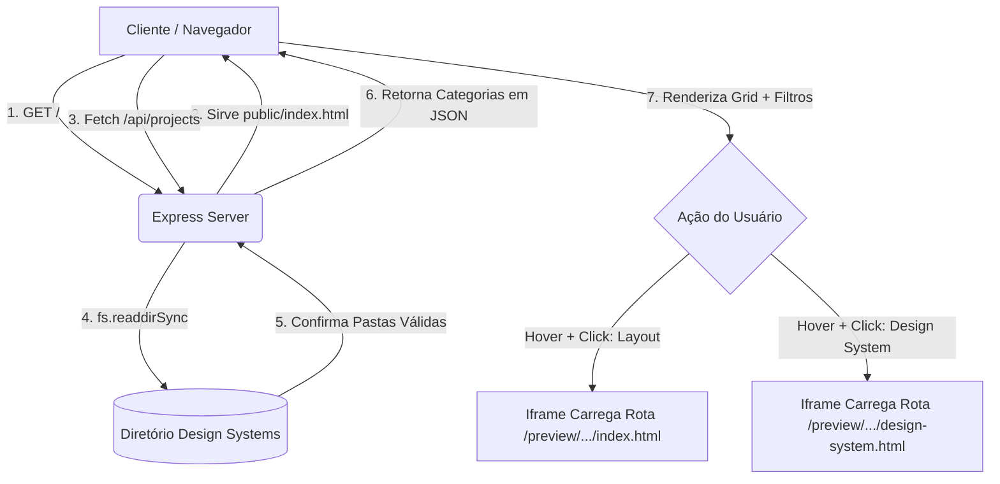

# 🎨 Vibe Design Methodology Showcase Server

> O Vibe Design Showcase é uma interface robusta desenvolvida para hospedar e demonstrar a metodologia de extração e criação web com IA. Ele resolve o problema de fragmentação de projetos ao criar uma "Sales Landing Page" dinâmica que mapeia componentes, temas claros e escuros de forma automatizada. Renderiza tudo com extrema fidelidade visual através de um iframe imersivo que preserva a renderização de elementos 3D/WebGL complexos, acelerando a aprovação de clientes e impressionando leads com uma estética premium.

## ✨ Funcionalidades
- **Mapeamento Automático:** Varredura dinâmica de diretórios pelo Node.js para indexar as categorias: `Componentes`, `Temas Claros` e `Temas Escuros`.
- **Dual-Action Preview:** Permite ao usuário escolher imediatamente através do hover se deseja visualizar o *Layout* da interface ou as especificações técnicas originais do *Design System*.
- **Iframe Imersivo (Zero-Delay):** O carregamento do projeto ocorre em um ambiente isolado, mas pré-inicializado no DOM (`pointer-events-none`), contornando bugs de cálculo de resolução típicos de bibliotecas como `UnicornStudio` e `Three.js` quando inseridos em elementos outrora ocultos.
- **Filtros Dinâmicos:** Categorização instantânea no lado do cliente sem necessidade de reload do servidor.
- **Aesthetic UI:** Interface desenhada usando princípios da metodologia *Neural/Parallax*, com animações SVG, background em grid customizado e efeitos de Glassmorphism utilizando Vanilla CSS e Tailwind.

## 📋 Requisitos
Para rodar a aplicação localmente, certifique-se de ter os seguintes requisitos:
- **Node.js** (v14 ou superior)
- **NPM** ou **Yarn**
- **Estrutura de Pastas:** Os projetos de referência de design devem estar em um diretório de nível superior `../Design Systems/`, estruturado obrigatoriamente com subpastas `componentes`, `temas_claros` e `temas_escuros`.

## 🚀 Instalação

Siga este passo a passo para inicializar o ambiente de demonstração de forma local:

1. Acesse o diretório do servidor criado:
```bash
cd "/caminho/para/Banco de Referências/ShowcaseServer"
```

2. Instale as dependências essenciais do backend (Express e Cors):
```bash
npm install
```

3. Inicie o servidor:
```bash
node server.js
```

4. O sistema estará em execução! Acesse no navegador:
```text
http://localhost:3000
```

## 📖 Uso

### Uso Básico
- Ao acessar a página, você verá uma Landing Page focada na conversão de autoridade sobre a técnica de IA.
- Use a barra estilo *Workspace* na direita para filtrar por categoria (Todos, Componentes, Claro, Escuro).
- Ao passar o mouse (*hover*) em qualquer projeto, o card exibe ações inteligentes. Selecione **Layout** para renderizar a página gerada no iframe com fundo infinito ou **Design System** para entender as especificações que basearam aquele estilo.

### Como Funciona



## 🔧 Adaptando / Casos de Uso

A arquitetura flexível deste Showcase pode ser adaptada para diferentes frentes de negócios e nichos:

| Nicho | Caso de Uso | Adaptação Necessária |
|---|---|---|
| **Agências de Web Design** | Mostrar portfólio restrito de componentes para aprovação ágil de clientes de alto padrão. | Customizar as chaves dos filtros para nichos reais (`E-commerces`, `Landing Pages`, `SaaS`). |
| **Equipes de Engenharia (DevOps)** | Catálogo interno das bibliotecas de UI/UX de uma organização. | Adicionar rotas na API para varrer e extrair properties de arquivos Vue/React em vez de apenas HTML. |
| **Infoprodutores e Vendas de Template** | Vitrine para venda de pacotes de Templates e Design Systems "Vibe Design". | Integrar Stripe nas ações de hover e limitar os arquivos estáticos de Iframe (Preview bloqueado ou Watermark). |

## 🗂️ Estrutura do Projeto e Workflow

| Componente | Tipo | Função Específica |
|---|---|---|
| `server.js` | Backend | Motor do Node.js. Serve a API em `/api/projects` e mapeia recursivamente as pastas como caminhos de rede estáticos (`/preview`). |
| `/api/projects` | Endpoint JSON | Lê os caminhos locais de referência e gera um mapa inteligente dos arquivos viáveis (`index.html` e `design-system.html`), filtrando os irrelevantes. |
| `public/index.html` | Frontend (UI) | Esqueleto semântico da Landing Page de Vendas. Concentra o DOM do Grid interativo e a estrutura isolada do Iframe. |
| `public/style.css` | Frontend (Estilo)| Guarda a complexidade visual do Design System "Neural/Parallax": Animações, Cards com multi-shadow, e interações baseadas no cursor sem poluir o HTML. |
| `public/app.js` | Frontend (Script)| Conecta as pontas: Bate na API, manipula os filtros dos arrays no cliente, injeta o SVG responsivo via loop e controla a transição limpa do Iframe (mantendo-o em `pointer-events-none` ao invés de oculto, resolvendo quebras de layout). |

---

> Desenvolvido com expertise em automação e design generativo orientado a IA, garantindo máxima fidelidade aos layouts e fluidez no workflow de arquitetura frontend.
